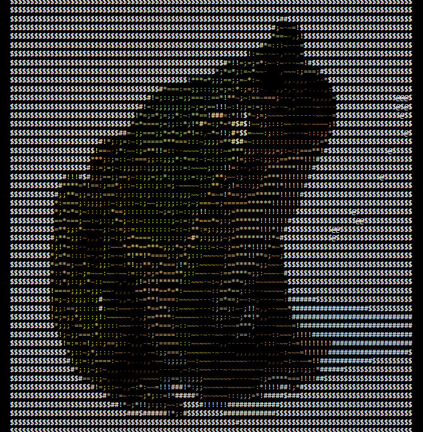

# ASCII Art Generator

A React-based web application that converts images into ASCII art with various styling options and a typing effect.

## Features
- Convert any image to ASCII art
- Multiple character sets (Simple, Detailed, Contrast, Blocks, Braille)
- Color modes (None, Grayscale, RGB)
- Typing animation effect
- Invert colors option
- Real-time reprocessing

## Installation

Open Repo in VsCode

Open a terminal

Run:
npm install

To start the app:

npm run dev

available at http://localhost:3000